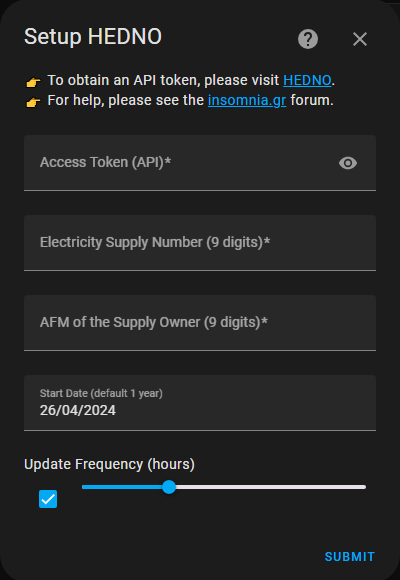
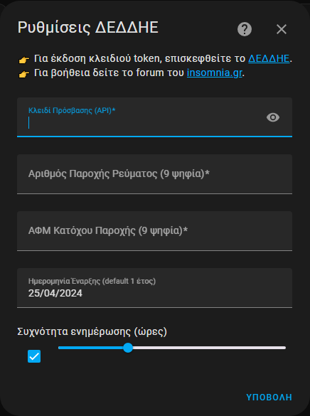
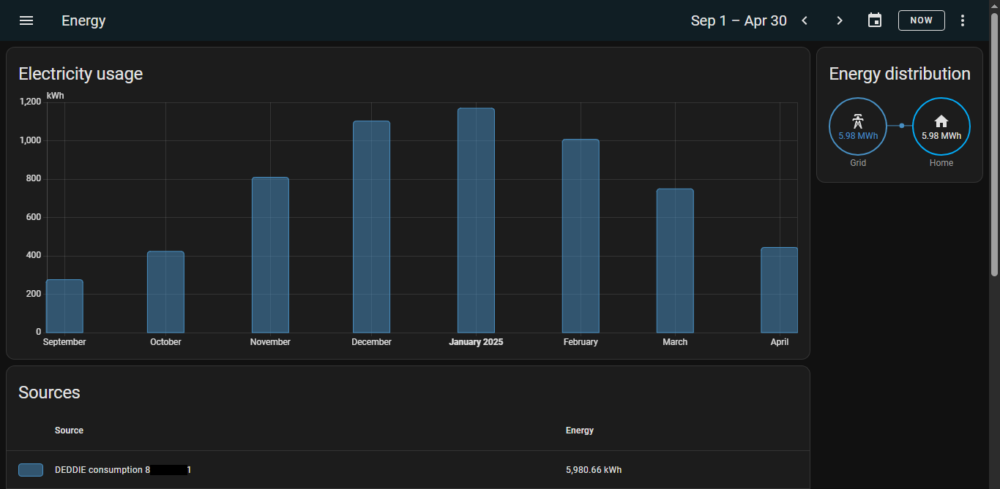
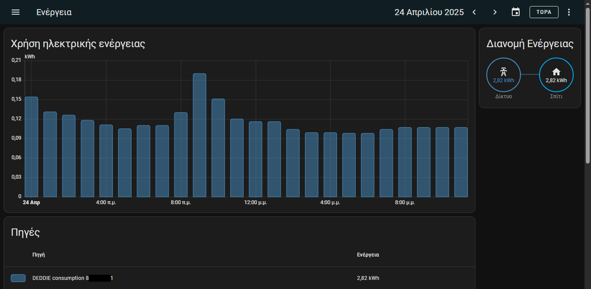
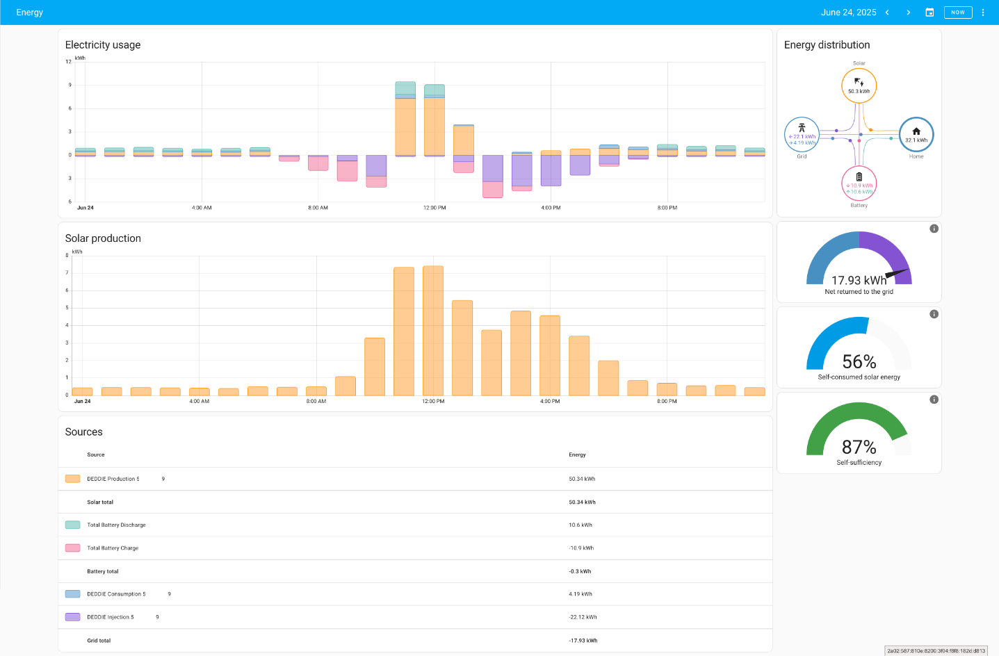
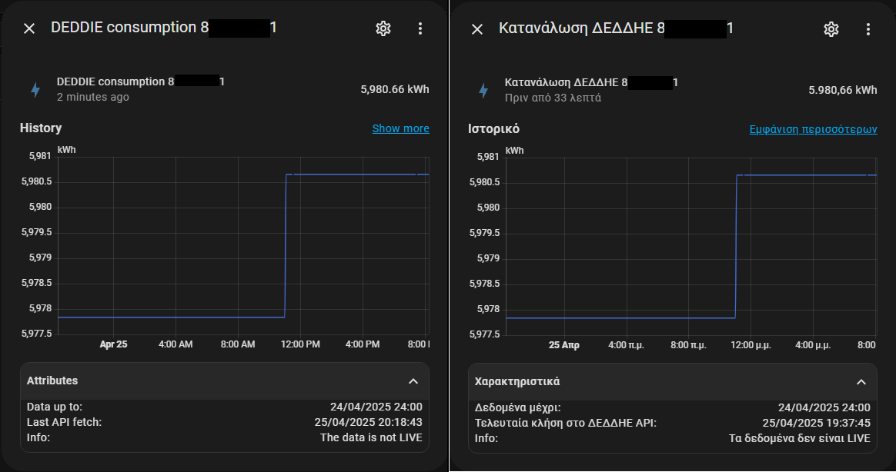
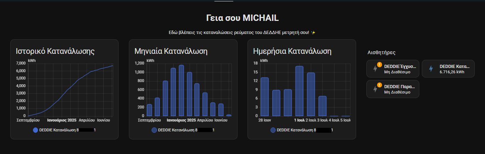
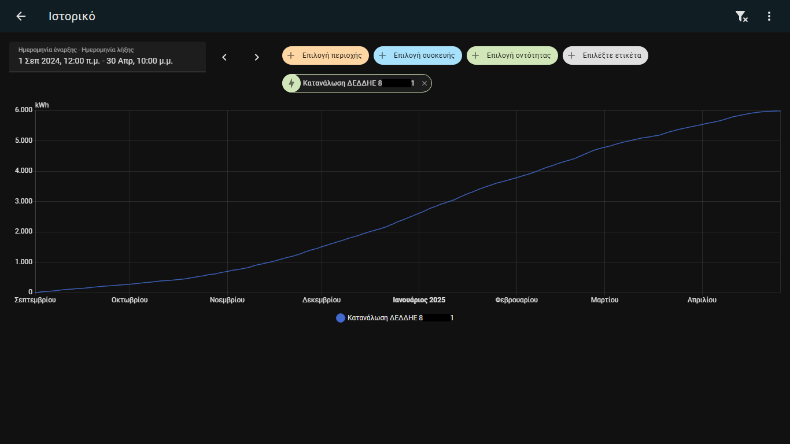
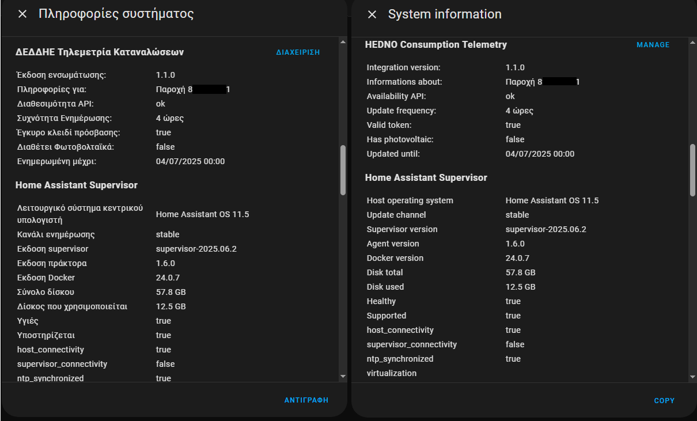

# HEDNO Consumption Telemetry - ΔΕΔΔΗΕ Τηλεμετρία Καταναλώσεων
[](https://hacs.xyz/docs/use/repositories/dashboard/)
[](https://github.com/mike81gr/deddie-metering/releases)
[](https://github.com/mike81gr/deddie-metering/actions/workflows/ci.yml)
[](https://codecov.io/gh/mike81gr/deddie-metering)
[](https://github.com/mike81gr/deddie-metering/releases)
[](https://www.ko-fi.com/mike81gr)


> 🌟 Home Assistant integration for automatic retrieval and monitoring of electricity consumption, production & injection energy data from the HEDNO platform.
>
> 🚀 Ενσωμάτωση Home Assistant για αυτόματη ανάκτηση και παρακολούθηση των δεδομένων κατανάλωσης, παραγωγής & έγχυσης ηλεκτρικής ενέργειας από την πλατφόρμα του ΔΕΔΔΗΕ.

---

## Table of Contents / Πίνακας Περιεχομένων

| English | Ελληνικά |
|---|---|
| [English Description](#english-section) | [Ελληνική Περιγραφή](#greek-section) |
| [Installation (via HACS)](#installation-section) | [Εγκατάσταση (μέσω HACS)](#installation-section) |
| [Configuration](#configuration_en-section) | [Ρυθμίσεις](#configuration_el-section) |
| [Options Flow](#options_flow_en-section) | [Ροή Επιλογών](#options_flow-el-section) |
| [Example configuration](#example_configuration_en-section) | [Παράδειγμα ρυθμίσεων](#example_configuration_el-section) |
| [Compatibility & Requirements](#compatibility_en-section) | [Συμβατότητα & Απαιτήσεις](#compatibility_el-section) |
| [Statistics & Recorder](#recorder_en-section) | [Στατιστικά & Recorder](#recorder_el-section) |
| [Notes](#notes_en-section) | [Σημειώσεις](#notes_el-section) |
| [Logging](#logging_en-section) | [Καταγραφή](#logging_el-section) |
| [Screenshots](#screenshots-section) | [Στιγμιότυπα](#screenshots-section) |
| [For Developers](#developers-section) | [Για Προγραμματιστές](#developers-section) |
| [Tests](#tests-section) | [Δοκιμές](#tests-section) |
| [Changelog](#changelog-section) | [Αρχείο Αλλαγών](#changelog-section) |
| [License](#license-section) | [Άδεια Χρήσης](#license-section) |
| [Support & Links](#support-section) | [Υποστήριξη & Σύνδεσμοι](#support-section) |
| [Disclaimer](#disclaimer-section) | [Αποποίηση Ευθύνης](#disclaimer-section) |

---

<h2 id="english-section">📚 English Description</h2>

**HEDNO Consumption Telemetry** is a custom integration for Home Assistant that connects to the official HEDNO (Hellenic Electricity Distribution Network Operator) API and retrieves electricity consumption, production & injection energy data for your metered supply.
- Supports validated credentials via dry‑run API call.
- Auto-detect for installed photovoltaic (PV).
- Periodic data fetching and restoration after restarts, with automatic detection of >365-day gaps to trigger batch-fetch of historical data (restriction by HEDNO API).
- Automatic purge of intermediate "flat" states after each successful update to ensure accurate history display.
- Adds statistics to the Home Assistant `recorder` database and corrects inconsistent sum of "future" records for consistent data visualization.
- Shows cumulative consumption (kWh) using  total_increasing "smart" energy sensors, with the ability to restore the last value and avoid data loss.
- Creating device "meter" including available energy sensors.
- Display diagnostic data in the Home Assistant "Health System".
- Supports translations (EN/EL), persistent notifications, and advanced handling of missing or partial data for statistics accuracy.
- **Multi-supply support**: Monitor multiple electricity supply numbers (e.g. home, store, office, vacation house).

---

<h2 id="greek-section">🖊️ Ελληνική Περιγραφή</h2>

Η ενσωμάτωση **ΔΕΔΔΗΕ Τηλεμετρία Καταναλώσεων** προσφέρει αυτοματοποιημένη ανάκτηση δεδομένων κατανάλωσης, παραγωγής & έγχυσης ηλεκτρικής ενέργειας από την υπηρεσία τηλεμετρίας του ΔΕΔΔΗΕ.
- Επαλήθευση διαπιστευτηρίων μέσω δοκιμαστικής κλήσης API.
- Αυτόματη ανίχνευση ύπαρξης εγκατεστημένων φωτοβολταϊκών.
- Περιοδική άντληση και αποθήκευση δεδομένων με ανίχνευση κενών >365 ημερών (περιορισμός από API ΔΕΔΔΗΕ) για τμηματική άντληση ιστορικών.
- Αυτόματος καθαρισμός των "flat" ενδιάμεσων καταστάσεων αισθητήρων μετά από κάθε ενημέρωση για ακριβής εμφάνιση ιστορικού.
- Εισαγωγή στατιστικών στο `recorder` και διόρθωση αθροίσματος "μελλοντικών" εγγραφών για συνεπή απεικόνιση δεδομένων.
- Εμφάνιση αθροιστικής κατανάλωσης (kWh) χρησιμοποιώντας "έξυπνους" αισθητήρες total_increasing, με επαναφορά τελευταίας τιμής και αποφυγή απώλειας δεδομένων.
- Δημιουργία συσκευής "μετρητή" με ενσωματωμένους τους διαθέσιμους αισθητήρες ενέργειας.
- Εμφάνιση διαγνωστικών δεδομένων στο "Σύστημα Υγείας" του Home Assistant.
- Υποστήριξη γλώσσας (EL/EN), μόνιμες ειδοποιήσεις, και προηγμένη διαχείριση ελλειπόντων δεδομένων.
- **Υποστήριξη πολλαπλών παροχών**: Παρακολούθηση πολλαπλών παροχών ηλεκτρικής ενέργειας (π.χ. σπίτι, κατάστημα, γραφείο, εξοχική κατοικία).

---

<h2 id="installation-section">🔧 Installation / Εγκατάσταση</h2>

<a href="https://my.home-assistant.io/redirect/hacs_repository/?owner=mike81gr&repository=deddie-metering&category=integration" target="_blank"></a>

---

<h2 id="configuration_en-section">⚙️ Configuration</h2>

<a href="https://my.home-assistant.io/redirect/config_flow_start/?domain=deddie_metering" target="_blank"></a>

You will need:
- Your **Access Token** from [apps.deddie.gr](https://apps.deddie.gr/mdp/intro.html)
- Your **Electricity Supply Number** (9 digits)
- Your **Tax Identification Number (TIN)** (9 digits)

Optional:
- **Start date** (defaults to 1 year ago)
- **Update frequency** (hours, between 1 and 24; default: 8)

<h2 id="configuration_el-section">⚙️ Ρυθμίσεις</h2>

<a href="https://my.home-assistant.io/redirect/config_flow_start/?domain=deddie_metering" target="_blank"></a>

Για τη ρύθμιση απαιτούνται:
- Το **Κλειδί Πρόσβασης** από [apps.deddie.gr](https://apps.deddie.gr/mdp/intro.html)
- Ο **Αριθμός Παροχής Ρεύματος** (9 ψηφία)
- Ο **ΑΦΜ** (9 ψηφία)

Προαιρετικά:
- **Ημερομηνία Έναρξης** (προεπιλογή: 1 χρόνος πίσω)
- **Συχνότητα ενημέρωσης** (ώρες: μεταξύ 1-24, προεπιλογή: 8)

---

<h2 id="options_flow_en-section">🔄 Options Flow</h2>

You can update your credentials and settings at any time:
1. Go to *Settings > Devices & Services > Integrations*.
2. Select **HEDNO Consumption Telemetry**, click **CONFIGURE**.
3. Modify **Access Token**, **Update Frequency**, or **Start Date**.
4. The integration will validate the token on save and trigger batch-fetch if the start date changes.

Persistent notifications will inform you of successful token renewal or any errors.

<h2 id="options_flow_el-section">🔄 Ροή Επιλογών</h2>

Μπορείτε να ενημερώσετε τα διαπιστευτήρια και τις ρυθμίσεις σας ανά πάσα στιγμή:
1. Μεταβείτε στις *Ρυθμίσεις > Συσκευές και υπηρεσίες > Ενσωματώσεις*.
2. Επιλέξτε **ΔΕΔΔΗΕ Τηλεμετρία Καταναλώσεων**, κάντε κλικ στο **ΔΙΑΜΟΡΦΩΣΗ**.
3. Τροποποιήστε το **Κλειδί Πρόσβασης**, **Συχνότητα Ενημέρωσης** ή **Ημερομηνία Έναρξης**.
4. Η ενσωμάτωση θα επικυρώσει το κλειδί token κατά την αποθήκευση και θα ενεργοποιήσει την τμηματική ανάκτηση δεδομένων εάν αλλάξει η ημερομηνία έναρξης.

Οι μόνιμες ειδοποιήσεις θα σας ενημερώνουν για επιτυχή ανανέωση κλειδιού πρόσβασης ή τυχόν σφάλματα.

---

<h2 id="example_configuration_en-section">📝 Example configuration</h2>



<h2 id="example_configuration_el-section">📝 Παράδειγμα ρυθμίσεων</h2>



---

<h2 id="compatibility_en-section">⚖️ Compatibility & Requirements</h2>

- Home Assistant Core **2024.10** or newer
- Telemetry feature enabled on your electricity meter

| **Integration Version** |  **HA Compatibility**  |
|---------------------|--------------------|
|       **1.1.0**         | **2025.10 or older**   |
|       **2.0.0**         | **2025.11 or newer**   |

<h2 id="compatibility_el-section">⚖️ Συμβατότητα & Απαιτήσεις</h2>

 - Home Assistant Core **2024.10** ή νεότερη έκδοση
 - Ενεργοποιημένη υπηρεσία τηλεμετρίας στον μετρητή σας

| **Έκδοση Ενσωμάτωσης** | **Συμβατότητα Έκδοσης HA** |
|--------------------|------------------------|
|       **1.1.0**        | **2025.10 ή παλαιότερη**   |
|       **2.0.0**        | **2025.11 ή νεότερη**      |

---

<h2 id="recorder_en-section">📊 Statistics & Recorder</h2>

This integration leverages the built-in Home Assistant `recorder` to store daily electricity statistics and allows you to:
- Use Energy Dashboard for available consumption/production/injection sensors.
- Monitor long-term trends.
- Automatically correct "future" statistical records (inconsistent sum) for consistent data visualization.
- Automatically purge intermediate "flat" states after updates for accurate history in the UI.
- Perform automations on kWh values (e.g. mobile notifications).

<h2 id="recorder_el-section">📊 Στατιστικά & Recorder</h2>

Η ενσωμάτωση αξιοποιεί τον μηχανισμό `recorder` του Home Assistant ώστε να:
- Απεικονίζονται οι διαθέσιμοι αισθητήρες κατανάλωση, παραγωγή & έγχυση ενέργειας στο Ταμπλό Ενέργειας του Home Assistant.
- Παρέχει ιστορικά δεδομένα μακροχρόνιας ανάλυσης.
- Διορθώνει αυτόματα "future" στατιστικές εγγραφές (ασυνεπές άθροισμα) για συνεπή απεικόνιση δεδομένων.
- Αυτόματη εκκαθάριση "ενδιάμεσων" καταστάσεων μετά από ενημερώσεις για ακριβές ιστορικό στη διεπαφή χρήστη.
- Υποστηρίζει αυτοματισμούς με βάση τις kWh (π.χ. ειδοποιήσεις συσκευών).

---

<h2 id="notes_en-section">ℹ️ Notes</h2>

- The data is only available if your electricity meter supports telemetry and the feature is activated.
- HEDNO requires a valid token and explicit approval to access the API.
- If the token expires, a persistent notification will appear in Home Assistant.
- If no data has been received for more than 365 days, the integration will automatically fetch historical data in batches to fill the gap.
- If no production data has been received for more than 7 days, the integration will notify you with a persistent notification to check the PV installation for any faults.
- **In a future photovoltaic installation (Net Metering), they will be automatically detected within one day and you will be informed with a persistent notification.**

<h2 id="notes_el-section">ℹ️ Σημειώσεις</h2>

- Τα δεδομένα είναι διαθέσιμα μόνο εφόσον ο μετρητής είναι συμβατός και έχει ενεργοποιηθεί η υπηρεσία τηλεμετρίας.
- Ο ΔΕΔΔΗΕ απαιτεί κλειδί πρόσβασης (token) και έγκριση για χρήση του API.
- Αν το token λήξει, θα εμφανιστεί σχετική ειδοποίηση στο περιβάλλον του Home Assistant.
- Εάν δεν έχουν ληφθεί δεδομένα για περισσότερες από 365 ημέρες, η ενσωμάτωση θα ανακτήσει αυτόματα δεδομένα ιστορικού σε παρτίδες για να καλύψει το κενό.
- Εάν δεν έχουν ληφθεί δεδομένα παραγωγής για περισσότερες από 7 ημέρες, η ενσωμάτωση θα σας ενημερώσεις με μόνιμη ειδοποίηση για να ελέγξετε την εγκατάσταση φωτοβολταϊκών για τυχόν βλάβες.
- **Σε μελλοντική εγκατάσταση φωτοβολταϊκών (Net Metering), θα γίνει αυτόματη ανίχνευση τους εντός μίας ημέρας και θα ενημερωθείτε με μία μόνιμη ειδποίηση.**

---

<h2 id="logging_en-section">🐞 Logging</h2>

To enable debug logs for this integration, add the following to your Home Assistant **configuration.yaml**:

```yaml
logger:
  default: warning
  logs:
    deddie_metering: debug
```
<h2 id="logging_el-section">🐞 Καταγραφή (Logging)</h2>

Για ενεργοποίηση των debug logs για αυτήν την ενσωμάτωση, προσθέστε τα παρακάτω στο configuration.yaml του Home Assistant σας:

```yaml
logger:
  default: warning
  logs:
    deddie_metering: debug
```

---

<h2 id="screenshots-section">🖼️ Screenshots / Στιγμιότυπα</h2>

### Energy Dashboard (Monthly View) / Πίνακας Ενέργειας (Μηνιαία)


### Daily Energy Detail/ Πίνακας Ενέργειας (Ημερήσια)



### Sensor Entity Detail / Λεπτομέρειες Αισθητήρα


### Long-term Consumption History / Μακροχρόνια στοιχεία



### System Health / Σύστημα Υγείας



---

<h2 id="developers-section">🧩 For Developers / Για Προγραμματιστές</h2>

📁 [Structure of / Δομή του Integration](docs/integration_structure.md)

For details on the file and folder organization of this integration, refer to integration_structure.md.

Για λεπτομέρειες σχετικά με τη δομή φακέλων και αρχείων αυτής της ενσωμάτωσης, ανατρέξτε στο integration_structure.md.

---

<h2 id="tests-section">🧪 Tests / Δοκιμές</h2>

To run the tests / Για να εκτελέσετε τις δοκιμές:
```bash
python3 -m venv .venv
source .venv/bin/activate    # Windows: .venv\Scripts\Activate.ps1
pip install -r requirements-test.txt
pytest --cov=deddie_metering tests/
```

---

<h2 id="changelog-section">📄 Changelog / Αρχείο Αλλαγών</h2>

For the full list of changes, see [CHANGELOG.md](CHANGELOG.md).

Για την πλήρη λίστα αλλαγών, βλέπε [CHANGELOG.md](CHANGELOG.md).

---

<h2 id="license-section">📄 License / Άδεια Χρήσης</h2>

This project is licensed under the **MIT License**. See the [LICENSE](LICENSE) file for details.

Το έργο διανέμεται υπό την άδεια **MIT**. Ανατρέξτε στο αρχείο [LICENSE](LICENSE) για λεπτομέρειες.

---

<h2 id="support-section">🛠️ Support & Links / Υποστήριξη & Σύνδεσμοι</h2>

- Report issues: [GitHub Issues](https://github.com/mike81gr/deddie-metering/issues)
- Forum (υποστήριξη): [insomnia.gr](https://www.insomnia.gr/forums/topic/841087-%CE%B4%CE%B5%CE%B4%CE%B4%CE%B7%CE%B5-%CF%84%CE%B7%CE%BB%CE%B5%CE%BC%CE%B5%CF%84%CF%81%CE%AF%CE%B1-%CE%BA%CE%B1%CF%84%CE%B1%CE%BD%CE%B1%CE%BB%CF%8E%CF%83%CE%B5%CF%89%CE%BD-deddie-consumption-metering)
- Έκδοση token: [apps.deddie.gr](https://apps.deddie.gr/mdp/intro.html)
- GitHub repo: [deddie\_metering](https://github.com/mike81gr/deddie-metering)

---

<h2 id="disclaimer-section">⚠️ Disclaimer / Αποποίηση Ευθύνης</h2>

This project is not affiliated with HEDNO (Hellenic Electricity Distribution Network Operator) in any way. "Deddie Μetering" is an unofficial Home Assistant integration, intended solely for personal use by the respective HEDNO customer, using their own credentials as provided through the official website.
This integration does not bypass any security measures and does not access or collect third-party data. The developer of this project takes no responsibility for:
- Any changes in HEDNO’s API or platform,
- The accuracy or availability of the returned data,
- Any misuse of the integration that violates HEDNO's terms of service.
- **Use of this integration is entirely at the user's own risk.**

Αυτό το έργο δεν σχετίζεται με κανέναν τρόπο με τον ΔΕΔΔΗΕ (Διαχειριστής Ελληνικού Δικτύου Διανομής Ηλεκτρικής Ενέργειας). Η "ΔΕΔΔΗΕ Τηλεμετρία" είναι μία ανεπίσημη ενσωμάτωση για το Home Assistant, σχεδιασμένη για χρήση αποκλειστικά από τον ίδιο τον πελάτη της υπηρεσίας, με τα δικά του διαπιστευτήρια, όπως αυτά του παρέχονται από την επίσημη ιστοσελίδα του ΔΕΔΔΗΕ.
Η ενσωμάτωση δεν παρακάμπτει τεχνικά μέτρα ασφαλείας και δεν χρησιμοποιείται για τη συλλογή δεδομένων τρίτων. Ο δημιουργός του εργαλείου δεν φέρει ευθύνη για:
- Τυχόν αλλαγές στο API ή τη λειτουργικότητα της πλατφόρμας του ΔΕΔΔΗΕ.
- Την ακρίβεια των δεδομένων που επιστρέφονται.
- Οποιαδήποτε χρήση του εργαλείου αντίθετη με τους όρους της ΔΕΔΔΗΕ.
- **Η χρήση γίνεται με αποκλειστική ευθύνη του τελικού χρήστη.**
---

Made with ❤️ by the Greek HA community.

Φτιαγμένο με ❤️ από την ελληνική κοινότητα Home Assistant.

## Αν Θέλετε να υποστηρίξετε το project:

<a href='https://ko-fi.com/mike81gr' target='_blank'></a>
